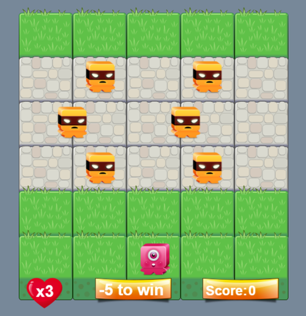

# Project: Arcade Game Clone

### Fend Nanodegree - Exploring JS Objects, Tools and Testing

You will be provided visual assets and a game loop engine, using these tools you must add a number of entities to the game including the player characters and enemies to recreate the classic arcade game Frogger.

### Brief introduction

In this game you have a Player and a few Enemies. The goal of the player is to reach the top, without colliding into any one of the enemies. The player can move left, right, up and down. The enemies move in varying speeds on their portion of the scene. Once a the player collides with an enemy, the game is reset and the player moves back to the start square. Once the player reaches the top the game is won.

### New skills applied from the Module:

* Practice object-oriented programming.

### Required:

* Player can not move off screen;
* Enemies cross the screen;
* Enemy-player collision resets the game;

### Additional features:

* Modifies to engine.js to render scores, lifes, counter;
* New graphic for player, enemy, score, lives, counter;
* Music effects;
* Bonus points if the game is won;
* A counter to show how many lap to win;
* Bonus life each new lap.

### License:

MIT License

Copyright (c) 2018 Cristiano Zitarosa

Permission is hereby granted, free of charge, to any person obtaining a copy of this software and associated documentation files (the "Software"), to deal in the Software without restriction, including without limitation the rights to use, copy, modify, merge, publish, distribute, sublicense, and/or sell copies of the Software, and to permit persons to whom the Software is furnished to do so, subject to the following conditions:

The above copyright notice and this permission notice shall be included in all copies or substantial portions of the Software.

THE SOFTWARE IS PROVIDED "AS IS", WITHOUT WARRANTY OF ANY KIND, EXPRESS OR IMPLIED, INCLUDING BUT NOT LIMITED TO THE WARRANTIES OF MERCHANTABILITY, FITNESS FOR A PARTICULAR PURPOSE AND NONINFRINGEMENT. IN NO EVENT SHALL THE AUTHORS OR COPYRIGHT HOLDERS BE LIABLE FOR ANY CLAIM, DAMAGES OR OTHER LIABILITY, WHETHER IN AN ACTION OF CONTRACT, TORT OR OTHERWISE, ARISING FROM, OUT OF OR IN CONNECTION WITH THE SOFTWARE OR THE USE OR OTHER DEALINGS IN THE SOFTWARE.
